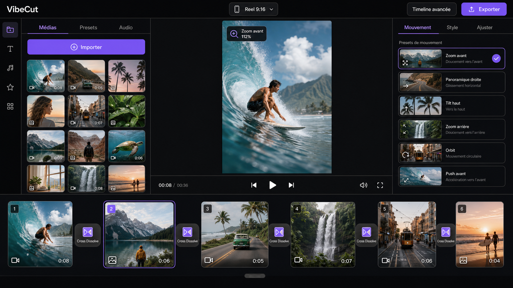
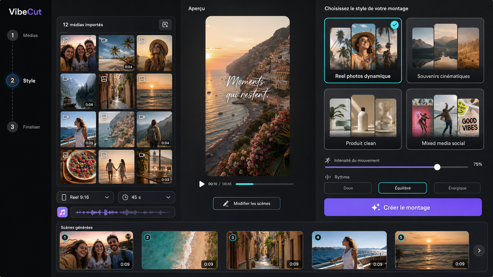
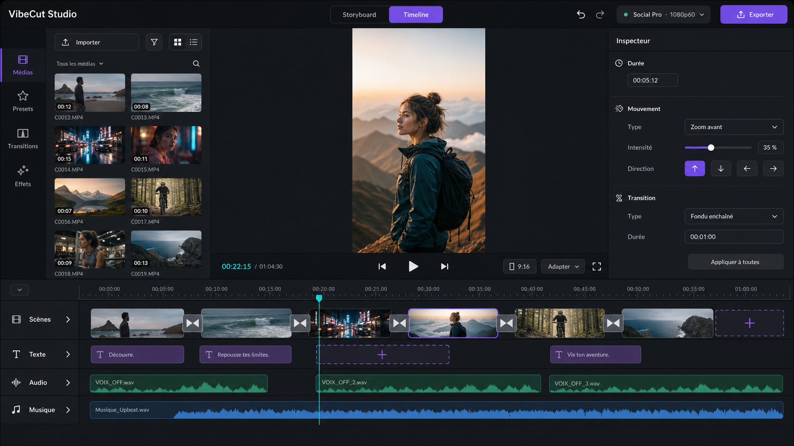
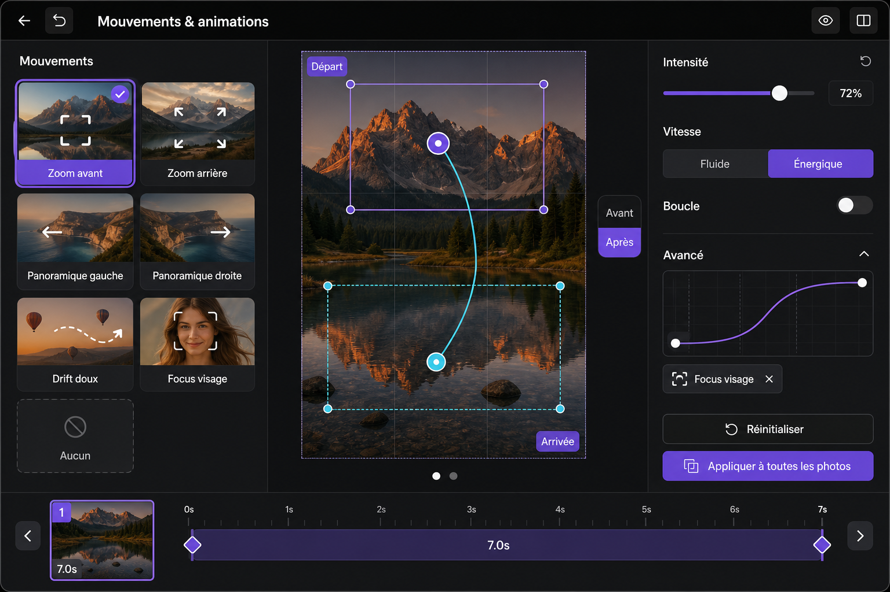
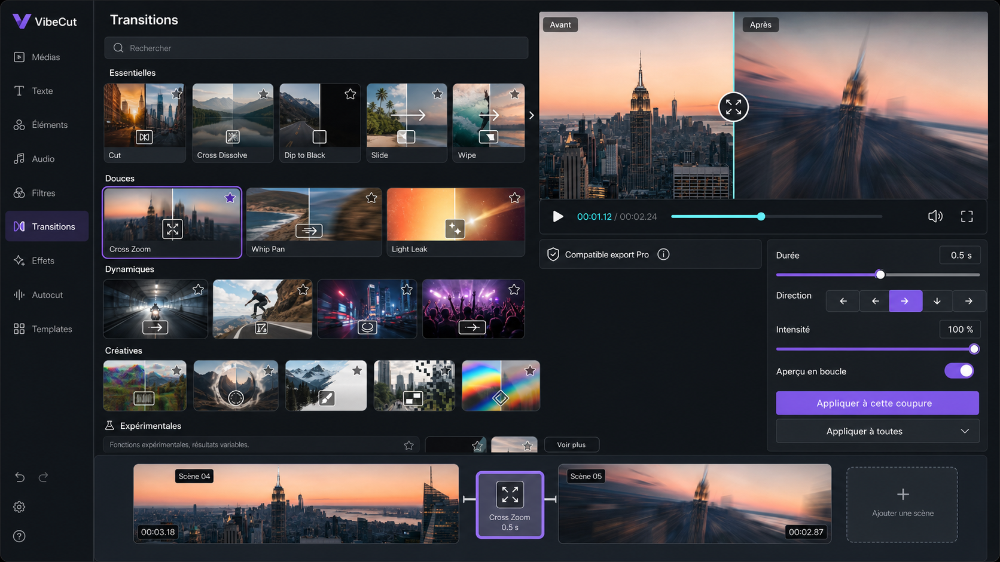

# VibeCut — checkpoint maître MVP, architecture et implémentation

Date de référence : 29 juillet 2026  
Statut final : MVP vertical testable, infrastructure live, limites avancées explicitement gardées  
Portée produit : montage social, principalement vertical, de quelques secondes à 15 minutes, jusqu'en 1080p60

## 1. Décision produit

VibeCut doit devenir un éditeur hybride à deux profondeurs, sans séparer les utilisateurs dans deux produits différents :

1. **Créer** : un parcours guidé par intention et modèle, destiné à obtenir un premier montage en quelques minutes.
2. **Storyboard** : l'espace simple par défaut, fondé sur des scènes visuelles, idéal pour dix photos, des vidéos courtes, des mouvements, des textes et des transitions.
3. **Timeline Pro** : une profondeur optionnelle pour le trim précis, les pistes, les keyframes, les courbes et le mixage.

Le passage Storyboard → Timeline Pro doit conserver exactement le même projet et rester réversible tant que l'utilisateur n'emploie pas une opération uniquement représentable en mode Pro.

Les cinq directions ImageGen ont été validées ensemble comme un seul système :

- `01-vibecut-flow-storyboard.png` : base de l'éditeur simple.
- `02-vibecut-create-guide.png` : onboarding, presets et génération guidée.
- `03-vibecut-studio-hybride.png` : articulation Storyboard / Timeline Pro.
- `04-module-mouvements-animations.png` : bibliothèque de mouvements, zooms et animations.
- `05-module-transitions.png` : bibliothèque de transitions, comparaison avant/après et réglages.

## 2. Audit vérifié à partir du code et du produit

Les documents détaillés restent les sources longues :

- [`vibecut-audit-mvp-ux-roadmap-2026-07-29.md`](./vibecut-audit-mvp-ux-roadmap-2026-07-29.md)
- [`vibecut-social-export-pro-architecture-2026-07-29.md`](./vibecut-social-export-pro-architecture-2026-07-29.md)

Ce checkpoint en retient les faits qui pilotent l'implémentation.

### 2.1 Import et stabilité

- L'import de MP4 valides fonctionne.
- Deux WebM présents dans le dépôt ont provoqué un crash complet de la timeline.
- La chaîne fautive accepte une durée média non finie (`Infinity`), puis construit des points d'aimantation seconde par seconde sans borne.
- L'import actuel de l'éditeur vidéo filtre les fichiers sur `video/*` : une photo ne peut pas entrer dans le montage vidéo.
- Les erreurs d'import restent insuffisamment visibles et récupérables.

### 2.2 Fidélité aperçu/export

- L'aperçu expose davantage de transitions, d'animations de texte, de filtres et de changements de vitesse que le renderer serveur.
- Une transition `cross-zoom` peut être posée dans l'interface, mais bloque ensuite l'export Pro.
- Le contrat actuel réellement exportable est essentiellement `cut`, `fade`, `crossfade` et texte `none`/`fade`.
- Le produit ne possède pas encore de registre central de capacités indiquant ce qui est disponible en aperçu, export navigateur, export CPU et export GPU.

### 2.3 Modèle de montage

- La timeline est surtout une séquence ripple de clips, malgré une présentation de NLE multipiste.
- Les effets sont dérivés des filtres des clips et ne constituent pas encore une piste indépendante robuste.
- Les sept pistes toujours visibles augmentent fortement la charge visuelle, y compris lorsqu'elles sont vides.
- Les composants principaux sont devenus très volumineux : timeline, moteur vidéo, store et panneau d'export concentrent trop de responsabilités.
- Il n'existe pas de modèle unifié photo/vidéo ni de mouvement Ken Burns proprement sérialisé et exporté.

### 2.4 UX mesurée

Sur un écran de test 1280 × 720 :

- 68 boutons visibles ;
- 85 nœuds texte terminaux ;
- 82 textes sous 11 px, soit environ 96 % ;
- minimum observé : 7 px.

Le produit propose beaucoup de puissance, mais présente trop d'actions simultanément, des libellés trop petits et des contrôles redondants. Le modèle mental n'est ni celui d'un storyboard simple, ni celui d'une timeline professionnelle complètement assumée.

### 2.5 Infrastructure d'export

L'architecture existante repose correctement sur Firebase pour l'identité, l'état projet et le stockage, mais le rendu vidéo audité reste trop proche d'un traitement HTTP synchrone, avec un profil limité et `libx264`.

La cible retenue est :

- Firebase Auth, App Check, Firestore et Storage comme control plane ;
- Cloud Tasks uniquement comme lanceur et mécanisme de backoff ;
- Cloud Run Jobs comme exécution asynchrone et isolée ;
- région principale `europe-west1` ;
- `cpu-standard` : 4 vCPU / 8 Gio ;
- `cpu-pro60` : 8 vCPU / 16 Gio ;
- `gpu-turbo` : 1 NVIDIA L4 / 8 vCPU / 32 Gio, seulement après benchmark concluant ;
- un export = un document de job idempotent, une exécution nommée, un output atomique et une annulation réelle ;
- cache/déduplication des sources par identifiant d'asset ;
- sources scellées et immuables pendant un export ;
- `maxRetries=0` au niveau natif, puis une seule relance contrôlée par l'application si elle est sûre ;
- validation systématique du fichier produit par `ffprobe`.

Le GPU n'est pas supposé être automatiquement plus performant. Il ne devient le chemin rapide que si le graphe FFmpeg utilise effectivement NVENC/CUDA et si les mesures qualité/coût/temps dépassent la référence CPU.

## 3. Vertical slice MVP de référence

Toutes les phases doivent converger vers le même montage test, afin d'éviter des fonctionnalités isolées non vérifiables :

- format 1080 × 1920 ;
- 60 fps ;
- durée cible 45 à 75 secondes pour la boucle de test rapide ;
- 10 photos ;
- 2 vidéos ;
- 1 musique ;
- 1 titre d'ouverture et 2 textes courts ;
- 4 mouvements d'image minimum : zoom avant, zoom arrière, panoramique, dérive ;
- 4 familles de transitions minimum : cut, fondu, slide, zoom ;
- réglage individuel de durée des scènes ;
- aperçu avant/après pour effets et transitions ;
- sauvegarde/rechargement du projet ;
- export local de référence ;
- export cloud CPU ;
- export cloud GPU uniquement après activation du pilote.

Une deuxième matrice de charge doit couvrir 5, 10 et 15 minutes en 1080p30 et 1080p60 sans demander de montage manuel complet.

## 4. Principes non négociables

1. Une option publiée dans l'interface doit être exportable par le chemin annoncé.
2. Aucun média corrompu, sans durée ou à durée non finie ne doit pouvoir bloquer l'éditeur.
3. Le mode simple doit produire un montage sans connaissance des pistes ou des keyframes.
4. Le mode Pro doit rester précis, sans perdre les décisions prises dans le Storyboard.
5. Tous les mouvements sont des données déterministes, pas des effets uniquement visuels dans React.
6. La qualité 60 fps est un preset explicite ; elle n'est jamais promise si l'asset source ou la route d'export ne la permet pas.
7. Le GPU reste derrière un feature flag jusqu'à validation mesurée.
8. L'état `queued/running/canceling/completed/failed` est visible et récupérable.
9. Une annulation coupe réellement le travail cloud.
10. Les tests s'appuient sur des médias dont la licence et la provenance sont enregistrées.

## 5. Système UX retenu

### 5.1 Navigation de premier niveau

- **Créer**
- **Storyboard**
- **Timeline Pro**
- **Exporter**

Les bibliothèques Média, Texte, Mouvement, Transition, Effet et Audio sont des outils contextuels, pas des destinations concurrentes.

### 5.2 Surface Storyboard

- rail média à gauche ;
- scène active et aperçu lisible au centre ;
- cartes de scènes en bas, avec durée et transition entre deux cartes ;
- inspecteur contextuel à droite ;
- bouton unique et clair pour passer en Timeline Pro ;
- commandes permanentes limitées aux opérations fréquentes.

### 5.3 Création guidée

Le guide demande successivement :

1. destination : Reel, TikTok, Story, Post ou libre ;
2. intention : dynamique, cinématique, minimal, produit, voyage, avant/après ;
3. médias ;
4. rythme ;
5. style de mouvement et de transition ;
6. musique et texte ;
7. génération du premier cut.

Le résultat reste entièrement éditable.

### 5.4 Bibliothèques

Chaque carte de transition, mouvement, effet ou titre comporte :

- miniature animée seulement lorsqu'elle est visible ;
- aperçu au survol ou au focus, sans déclenchement permanent ;
- comparaison avant/après quand cela apporte une preuve ;
- nom lisible et tags utiles ;
- compatibilité d'export visible ;
- intensité ou durée modifiable ;
- action `Appliquer` explicite ;
- états chargement, indisponible, erreur et appliqué.

### 5.5 Timeline Pro

- pistes vides repliées par défaut ;
- hauteur et densité adaptables ;
- glisser-déposer fluide avec aperçu de placement ;
- trim avec retour visuel immédiat ;
- aimantation bornée et sûre ;
- zoom horizontal stable ;
- inspector et raccourcis cohérents ;
- menus avancés progressifs pour keyframes, courbes et audio.

## 6. Contrat visuel et mouvement

- Canvas presque noir, panneaux ardoise distincts, séparateurs nets.
- Violet VibeFX pour l'action principale ; cyan réservé au signal temporel, à la lecture et à la sélection technique.
- Pas de halo sur tous les composants ; la lumière sert uniquement à orienter l'attention.
- Texte de travail généralement entre 13 et 16 px ; microtexte réservé aux timecodes et métadonnées.
- Cibles tactiles principales d'au moins 44 px.
- Sélection indiquée par forme, bordure ou marqueur, jamais uniquement par couleur.
- Mouvement d'interface fonctionnel : 120–220 ms pour les états, 200–280 ms pour les panneaux.
- Animations de contenu et prévisualisations limitées aux éléments visibles.
- Transform et opacité en priorité ; aucune animation de dimension de la timeline.
- `prefers-reduced-motion` fournit un état statique complet et lisible.

## 7. Roadmap d'implémentation

### Phase 0 — Fondation sûre et vérité des capacités

Objectifs :

- borner et normaliser toutes les durées ;
- empêcher les boucles d'aimantation non finies ;
- afficher une erreur d'import récupérable ;
- créer un registre de capacités preview/export ;
- masquer ou marquer les fonctions non rendues ;
- ajouter les cas `Infinity`, `NaN`, zéro et média illisible aux tests.

Sortie :

- les WebM problématiques ne font plus planter l'application ;
- aucune fonctionnalité publiée ne bloque tardivement l'export ;
- lint, build et smokes timeline/store/export passent.

### Phase 1 — Modèle média unifié et montage photo

Objectifs :

- introduire `Asset` et `SceneClip` pour photo, vidéo et audio ;
- permettre l'import multiple photo + vidéo ;
- définir durée, crop, fit/fill et orientation ;
- ajouter le mouvement Ken Burns déterministe ;
- produire la même transformation en aperçu et en FFmpeg.

Sortie :

- dix photos peuvent être déposées et automatiquement séquencées ;
- zoom avant/arrière, panoramique et dérive sont sauvegardés, rechargés et exportés.

### Phase 2 — Créer et Storyboard

Objectifs :

- construire le parcours guidé ;
- proposer des presets sociaux et styles de montage ;
- générer automatiquement le premier cut ;
- mettre le Storyboard au centre de l'expérience ;
- permettre réorganisation, durée, duplication et remplacement en un geste.

Sortie :

- un utilisateur novice obtient un montage cohérent depuis dix médias sans ouvrir la timeline.

### Phase 3 — Bibliothèques de création

Objectifs :

- unifier transitions, mouvements, effets et titres ;
- ajouter miniatures paresseuses et aperçu avant/après ;
- implémenter réellement les familles publiées côté renderer ;
- ajouter réglages simples puis avancés ;
- versionner les capacités pour les projets enregistrés.

Sortie :

- les cartes validées dans l'UI ont une parité mesurée avec l'export.

### Phase 4 — Timeline Pro

Objectifs :

- décomposer le composant monolithique ;
- replier les pistes inutiles ;
- fiabiliser drag, trim, ripple, snapping et zoom ;
- améliorer la lisibilité et les tailles d'interaction ;
- préserver le round-trip Storyboard/Pro.

Sortie :

- aucune perte de projet lors du changement de mode ;
- interactions stables sur les montages de test à 15 minutes.

### Phase 5 — Rendu cloud CPU professionnel

Objectifs :

- rendre le flux complètement asynchrone avec Cloud Run Jobs ;
- créer les profils `cpu-standard` et `cpu-pro60` ;
- ajouter idempotence, progression, annulation, validation et reprise contrôlée ;
- aligner les quotas applicatifs sur 15 minutes ;
- ajouter observabilité, budgets et limites de concurrence.

Sortie :

- export 1080p60 de 15 minutes réussi sur `cpu-pro60` ;
- absence de doublon après retry ;
- annulation vérifiée ;
- output validé et téléchargeable.

### Phase 6 — Pilote GPU L4 et routeur coût/performance

Objectifs :

- ajouter une image FFmpeg capable de NVENC/CUDA ;
- mesurer CPU et GPU sur la même matrice ;
- contrôler VMAF/SSIM, poids, temps, coût estimé et stabilité ;
- activer `gpu-turbo` seulement si les gates sont atteints ;
- conserver `cpu-pro60` comme référence et fallback.

Gates proposées :

- gain de temps p50 significatif, cible ≥ 1,8× sur les montages éligibles ;
- qualité dans la tolérance définie face à CPU ;
- coût par export égal ou inférieur au budget produit retenu ;
- aucun filtre important ne provoque de transfert CPU/GPU annihilant le gain.

Sortie :

- routeur documenté avec décision `GPU activé`, `GPU limité` ou `GPU rejeté`.

### Phase 7 — Validation A à Z

Objectifs :

- constituer un corpus de médias libres de droits avec manifeste de licences et hashes ;
- ajouter des fixtures synthétiques reproductibles ;
- créer au moins trois projets de démonstration ;
- tester création, édition, sauvegarde, reprise, export, annulation et téléchargement ;
- vérifier mobile, desktop, clavier et reduced motion ;
- produire un rapport avec preuves et défauts résiduels.

Montages :

1. **Photos dynamiques** : 10 photos, 45–60 s, Ken Burns, quatre transitions, titres, musique.
2. **Social mix** : 6 photos + 4 clips vidéo, 60–90 s, effets légers, texte et audio.
3. **Charge export** : scénario généré de 5, 10 et 15 minutes en 30/60 fps.

Sortie :

- les tests automatisés et interactifs sont verts ;
- les vidéos finales sont lisibles et contrôlées par `ffprobe` ;
- l'utilisateur reçoit un parcours exact pour son propre test.

## 8. Ordre d'exécution et état

| Phase | État initial | Gate de démarrage | Gate de fin |
| --- | --- | --- | --- |
| Checkpoint maître | Terminé | Visuels et audits validés | Document et références archivés |
| Phase 0 | Terminé le 29/07/2026 | Checkpoint terminé | Stabilité + registre + tests |
| Phase 1 | Terminée le 29/07/2026 | Phase 0 verte | Photo/Ken Burns exportable |
| Phase 2 | Terminée MVP le 29/07/2026 | Modèle média stable | First cut guidé sans timeline |
| Phase 3 | Terminée MVP le 29/07/2026 | Storyboard utilisable | Bibliothèques contextuelles et capacités visibles |
| Phase 4 | Terminée MVP le 29/07/2026 | Round-trip défini | Timeline Pro lisible et testée |
| Phase 5 | Live le 29/07/2026 | Contrat renderer stabilisé | CPU cloud A à Z, téléchargement sécurisé |
| Phase 6 | Benchmark terminé le 29/07/2026 | Baseline CPU mesurée | GPU L4 rejeté par le routeur |
| Phase 7 | Terminée pour le vertical slice le 29/07/2026 | Fonctions MVP intégrées | Exports CPU/GPU réels et tests UI avec corpus licencié |

Le tableau sera mis à jour à la fin de chaque phase avec la date, les changements, les preuves de test et les limites restantes.

### Journal Phase 0 — terminé

Implémenté :

- résolution bornée des durées média et contournement contrôlé du cas WebM `Infinity` ;
- rejet récupérable des durées `Infinity`, `NaN`, nulles ou hors borne avant entrée dans le store ;
- grille de snapping limitée à 3 600 repères temporels, tout en conservant début, fin et repères métier ;
- message d'import visible avec états analyse, succès, succès partiel et erreur ;
- registre `SERVER_RENDER_CAPABILITIES` versionné ;
- cartes et options marquées `Export Pro` ou `Aperçu uniquement` ;
- transitions et animations non rendues désactivées à la création ;
- presets texte rapides remis sur le contrat `fade` exportable ;
- mode d'authentification dev stabilisé face au callback Firebase tardif ;
- `better-sqlite3` recompilé pour Node 22 sur ce Mac ;
- Git LFS 3.7.1 installé pour macOS ARM64.

Preuves :

- lint ciblé : réussi ;
- `npm run test:vibecut-export` : réussi ;
- `npm run test:video-ui` : réussi, 3 tests exécutés et 7 tests explicitement ignorés faute de fixtures LFS réelles ;
- smoke navigateur dédié : les deux WebM d'audit ne provoquent plus de crash ;
- smoke navigateur dédié : Cross Dissolve est `Export Pro`, Cross Zoom est visible mais désactivé `Aperçu uniquement` ;
- `npm run build` : réussi.

Limite externe découverte :

- les anciens MP4 et au moins une piste audio du dépôt sont des pointeurs Git LFS ;
- le serveur GitHub retourne `404 Object does not exist on the server` pour les objets correspondants ;
- Git LFS est désormais correctement installé localement, mais ces anciens binaires ne peuvent pas être récupérés depuis le dépôt ;
- la Phase 7 constituera donc un nouveau corpus licencié et reproductible au lieu de dépendre de ces pointeurs perdus.

### Journal Phase 1 — terminé

Implémenté :

- modèle média unifié sur la piste canonique avec `mediaType`, `mimeType`, `assetId`, durée et mouvement ;
- import multiple photos + vidéos depuis le même bouton et le même glisser-déposer ;
- scènes photo de quatre secondes par défaut, réglables de 1 à 15 secondes dans l'interface MVP ;
- six presets déterministes : fixe, zoom avant, zoom arrière, panoramique gauche, panoramique droite et montée ;
- panneau `Mouvement` accessible depuis la barre d'outils ;
- preview Canvas compatible image, transitions et filtres, sans fausse piste audio ;
- manifeste Export Pro versionné avec type média et paramètres de mouvement ;
- upload Firebase owner-scoped des sources image dans `sources/image/` avec règle Storage dédiée ;
- validation de couverture alignée entre client, Functions et renderer ;
- rendu FFmpeg des images par boucle bornée et `zoompan`, compatible concat et crossfade ;
- badges photo/mouvement dans la timeline.

Preuves :

- lint ciblé : réussi ;
- smoke store : import, durée et mouvement photo réussis ;
- smoke manifeste : scène photo Ken Burns déclarée exportable ;
- smoke FFmpeg réel : MP4 vertical créé depuis deux images avec zoom, panoramique et crossfade ;
- `npm run test:vibecut-export` : réussi ;
- parité de couverture client/Functions/renderer : réussie sur les 12 cas historiques ;
- `npm run test:video-ui` : réussi, 4 tests exécutés et 7 anciens tests ignorés faute de fixtures LFS ;
- smoke navigateur photo : trois images importées, panneau Mouvement ouvert, zoom avant appliqué, durée passée à 6,5 secondes ;
- `npm run build` : réussi.

Limite assumée avant Phase 2 :

- la création reste manuelle : l'utilisateur doit encore choisir scène par scène les mouvements ;
- la Phase 2 ajoutera le flux guidé et la génération automatique d'un premier montage sans obliger à ouvrir la Timeline Pro.

### Journal Phases 2 à 4 — expérience de création terminée pour le MVP

Implémenté :

- mode **Créer** guidé avec presets social dynamique, photo cinématique et produit propre ;
- génération automatique d'un premier montage depuis les médias importés ;
- Storyboard avec scènes, durées, mouvements, transitions, looks et titres ;
- comparaison avant/après dans le module de filtres ;
- Timeline Pro conservant le même store et le même projet ;
- import compact et visible en mode Pro, timeline bornée à la hauteur disponible et panneaux contextuels ;
- sauvegarde/reprise locale dans IndexedDB ;
- génération Tailwind reproductible avant `dev` et `build`, limitée aux sources applicatives ;
- mode Pro vérifié visuellement à 1280 × 720 après correction du layout.

La compétence ImageGen a servi à définir les cinq directions validées, puis l'inspection réelle du navigateur a forcé deux corrections que les maquettes seules ne montraient pas : la feuille Tailwind était périmée et l'import Pro était repoussé hors écran.

Preuves :

- `npm run test:video-ui` : modèle timeline, store, persistance, manifestes et image render verts ; 4 scénarios navigateur réussis, 7 scénarios historiques ignorés faute de leurs anciens objets Git LFS ;
- `npm run test:vibecut-tools` avec le corpus Pexels : 2 scénarios réussis ;
- parcours Pro testé : deux MP4, texte, Cross Dissolve, filtre Vivid Contrast, avant/après, suppression ;
- les volets dont les animations serveur ne sont pas encore rendues restent visibles mais désactivés avec le badge `Aperçu uniquement`.

Limites assumées :

- les animations avancées de texte et plusieurs transitions créatives ne sont pas encore exportables ; elles sont bloquées avant d'entrer dans un projet exportable ;
- l'effet reste stocké principalement dans les filtres du clip, pas encore comme une vraie pile d'effets multipiste ;
- le round-trip Storyboard/Pro est fonctionnel pour le modèle MVP, pas encore pour des keyframes et courbes avancées.

### Journal Phase 5 — rendu CPU et téléchargement live

Infrastructure déployée dans `vibefx-v2`, région `europe-west1` :

- job `vibecut-render-cpu-standard` : 4 vCPU / 8 Gio ;
- job `vibecut-render-cpu-pro60` : 8 vCPU / 16 Gio ;
- orchestration Firebase → Cloud Tasks → Cloud Run Jobs ;
- Functions vidéo migrées vers Node.js 22 ;
- conteneurs CPU et service de téléchargement migrés vers Node.js 22 ;
- service `vibecut-download-service`, révision `vibecut-download-service-00003-2tb` ;
- liens de téléchargement HMAC de quinze minutes, revalidation propriétaire/statut/path dans Firestore, streaming Storage avec support Range et `no-store` ;
- ancienne Function `downloadVideoExportFile`, limitée à 32 Mio de réponse, retirée du code et supprimée du cloud ;
- estimation de coût corrigée en secondes et alignée sur CPU, mémoire et L4 Cloud Run.

Preuve live CPU :

- job Firestore `TQ8DkRQgTxFhjKPDVrbQ` ;
- exécution `vibecut-render-cpu-pro60-ff8cs` ;
- 15,5 s, 1080 × 1920, H.264 + AAC, 60 fps ;
- temps total 76,058 s, dont FFmpeg 73,685 s ;
- 34 230 294 octets ;
- SHA-256 `073aed87fbdf93a345df6e26a3e4a0ade22d97d9ace2bd2dcdb32160357e8ea8`.

Les jobs CPU live utilisent l'image Node 22 `vibecut-render-job:20260729-211605`.

### Journal Phase 6 — décision GPU mesurée

Le pilote NVIDIA L4 existe et reste déployé pour les futurs graphes réellement accélérés :

- job `vibecut-render-gpu-turbo` : 8 vCPU / 32 Gio / 1 NVIDIA L4 ;
- image Node 22 `vibecut-render-gpu:20260729-211945` ;
- encodage `h264_nvenc` vérifié dans l'image ;
- routeur maintenu à `EXPORT_GPU_ENABLED=false`.

Benchmark identique au CPU :

- exécution GPU `vibecut-render-gpu-turbo-bcwmh` ;
- temps total 95,310 s, dont FFmpeg 92,014 s ;
- 67 333 381 octets ;
- SHA-256 `cb87a8988686b2f6e263cdfc3f12c700a45441d315f4c4e29ddffa5d33e569c4`.

Décision : **GPU rejeté pour le chemin MVP actuel**. Il est environ 25 % plus lent que `cpu-pro60`, produit un fichier environ deux fois plus lourd et coûte davantage. Le graphe actuel exécute transitions, texte et filtres sur CPU ; seule la dernière étape d'encodage profite de NVENC. Le GPU ne sera réactivé qu'après portage effectif d'une part significative du graphe vers CUDA et nouveau benchmark.

### Journal Phase 7 — validation finale du vertical slice

Corpus :

- deux vidéos Pexels réelles, l'une à 60 fps ;
- URLs sources et licence conservées dans `work/vibecut-mvp-corpus/LICENSES.md` ;
- anciens pointeurs Git LFS invalides explicitement exclus des tests.

Gates réussies :

- build Next.js 16.2.12 ;
- lint sans erreur, dix avertissements historiques hors cœur VibeCut ;
- audits de production racine, Functions et renderer : zéro vulnérabilité connue ;
- application locale, Functions, renderer et service de téléchargement sous Node.js 22 ;
- tests manifestes, quotas, idempotence, annulation, profils CPU/GPU, téléchargement, couverture et parité client/serveur ;
- test UI réel avec les deux vidéos licenciées ;
- sortie cloud téléchargée puis validée par `ffprobe` ;
- jetons App Check temporaires nettoyés.

Dette résiduelle non bloquante pour le test MVP :

- une alerte Turbopack signale le traçage trop large de la route existante `api/music/local-file-import` ;
- dix avertissements ESLint préexistants concernent images et dépendances de hooks hors parcours VibeCut ;
- le service historique synchrone `vibecut-render-service` reste public comme fallback ancien et doit être privatisé ou retiré après validation qu'aucun autre flux ne l'utilise ;
- Firestore `(default)` reste en `nam5` alors que le rendu et le stockage sont européens ;
- la matrice synthétique complète 5/10/15 minutes n'a pas encore été exécutée : l'architecture accepte quinze minutes, mais la preuve live de cette session porte sur 15,5 secondes.

## 9. Stratégie de test

### Tests rapides à chaque changement

- lint ciblé ;
- tests du modèle timeline et du store ;
- test du compilateur/export ;
- test de sérialisation du projet ;
- build Next.js.

### Tests interactifs à chaque phase UX

- import par bouton et glisser-déposer ;
- navigation clavier ;
- viewport 1280 × 720, grand desktop et mobile ;
- états vides, chargement, succès, erreur et récupération ;
- reduced motion ;
- mesure du nombre de commandes visibles et de la taille des textes.

### Tests renderer

- même projet sur chaque profil ;
- `ffprobe` : codec, durée, dimensions, framerate, audio et intégrité ;
- captures de frames de contrôle ;
- VMAF/SSIM lorsque la référence le permet ;
- temps file d'attente, démarrage, rendu et upload ;
- coût estimé par export ;
- retry, annulation, timeout et duplication.

## 10. Déploiement et sécurité opérationnelle

- Aucun secret ne doit entrer dans Git.
- Les `.env.example` décrivent les variables sans leurs valeurs.
- La présence des accès Google/Firebase est vérifiée sans afficher les secrets.
- Les nouveaux rôles de service suivent le moindre privilège.
- App Check protège les appels client.
- Les Jobs de rendu n'exposent aucun endpoint public.
- Les sources d'un export sont scellées avant lancement.
- Les déploiements cloud sont regroupés après réussite locale pour limiter les coûts et les rollouts inutiles.
- Les profils GPU et les concurrencias élevées restent désactivés par défaut.

## 11. Dépendances externes et conditions possibles

L'implémentation locale ne dépend pas d'une intervention humaine. Les points suivants peuvent toutefois nécessiter une validation Google :

- connexion du compte `gcloud`/Firebase sur ce Mac ;
- sélection confirmée du projet GCP ;
- APIs Cloud Run, Cloud Build, Artifact Registry, Cloud Tasks et GPU ;
- quota NVIDIA L4 dans la région choisie ;
- autorisations IAM pour créer les service accounts, Jobs et files Cloud Tasks ;
- budget d'essai et alertes de facturation.

Une absence de quota GPU ne bloque pas le MVP : le chemin CPU reste le chemin de référence.

## 12. Définition finale de “MVP testable”

Le MVP est remis à l'utilisateur seulement lorsque :

- il démarre localement avec la commande documentée ;
- photos et vidéos s'importent sans crash ;
- un modèle guidé crée un montage initial ;
- le Storyboard permet de finir le montage ;
- la Timeline Pro ouvre le même projet ;
- les mouvements et transitions publiés sont prévisualisés et exportés ;
- le projet survit à une sauvegarde/reprise ;
- un export 1080p60 CPU aboutit ;
- l'état d'export, l'annulation et les erreurs sont compréhensibles ;
- les tests A à Z ont déjà produit et validé les montages de démonstration ;
- toute limite restante est écrite et visible avant l'action concernée.

Ce checkpoint est la référence de portée. Toute nouvelle fonction doit soit servir directement ce vertical slice, soit être reportée après le MVP.
