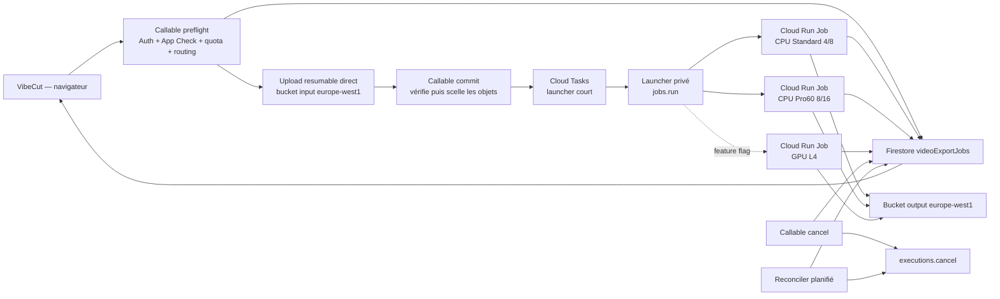

# VibeCut — Architecture cible d'export vidéo social Pro

- Date de décision : 2026-07-29
- Périmètre : exports vidéo sociaux jusqu'à 10 minutes, priorité 1080p vertical/horizontal, 60 FPS lorsque la source le justifie, haute qualité et montée en charge progressive.
- Statut : architecture MVP implémentée et validée sur un vertical slice réel ; matrice longue 5/10/15 minutes encore à exécuter.

## Addendum d'exécution — 29 juillet 2026

- Les profils CPU et GPU sont live en `europe-west1`, sous Node.js 22.
- Référence CPU Pro : 15,5 s en 1080 × 1920, H.264/AAC 60 fps, 76,058 s de bout en bout, 34,2 Mo.
- Pilote L4 : 95,310 s de bout en bout et 67,3 Mo sur le même montage.
- Décision mesurée : conserver `cpu-pro60` comme route active et `EXPORT_GPU_ENABLED=false`.
- Cause : le graphe de filtres, textes et transitions reste CPU ; NVENC n'accélère que l'encodage final.
- Le téléchargement final est assuré par un service Cloud Run de streaming signé, sans limite de réponse Firebase Functions à 32 Mio.
- Les audits de dépendances de production de l'application, des Functions et du renderer ne signalent aucune vulnérabilité connue.

## 1. Décision exécutive

L'architecture recommandée conserve Firebase comme cockpit du produit, mais remplace le rendu HTTP synchrone par des exécutions asynchrones Cloud Run Jobs.

Choix cible :

- Firebase Auth + App Check pour l'identité et l'anti-abus.
- Firestore pour la machine d'état, les leases, la progression, la facturation estimée et l'historique.
- Cloud Storage/Firebase Storage pour les sources, manifests et sorties.
- Cloud Tasks uniquement pour lancer rapidement un job, jamais pour attendre la fin de FFmpeg.
- Cloud Run Jobs pour une exécution isolée par export, sans dépendre d'une connexion HTTP longue.
- Un data plane export dédié en `europe-west1` (Belgique), proche de Paris et compatible CPU, GPU L4 et disque éphémère Cloud Run Jobs :
  - buckets régionaux séparés pour les inputs et outputs temporaires ;
  - Artifact Registry renderer ;
  - Cloud Tasks/launcher ;
  - jobs CPU et GPU.
- Deux profils CPU :
  - `cpu-standard` : 4 vCPU / 8 Gio ;
  - `cpu-pro60` : 8 vCPU / 16 Gio.
- Un profil GPU L4 préparé dès l'architecture, puis activé comme route finale rapide seulement après benchmark :
  - `gpu-turbo` : 1 L4 / 8 vCPU / 32 Gio recommandé pour garder assez de CPU pour les filtres non accélérés.
- Chaque Job utilise `taskCount=1`, `parallelism=1` et `maxRetries=0`. Un second essai éventuel est créé explicitement par l'orchestrateur.
- Aucune ressource inactive facturée entre les exécutions ; chaque task reste toutefois soumise au minimum facturable Cloud Run.
- Lecture des sources à benchmarker entre FUSE read-only, téléchargement contrôlé des assets uniques vers disque ext4 et API Storage. Aucune option ne doit recopier aveuglément toutes les sources en mémoire. Seule la sortie finale utilise un scratch local borné.
- Le disque éphémère ext4 Cloud Run Jobs sera benchmarké, mais restera optionnel tant qu'il est en Preview.
- H.264/AAC MP4 comme format social universel initial, avec rendu SDR Rec.709, CFR et métadonnées explicites.

Le GPU ne doit pas être activé par défaut avant preuve mesurée. Le renderer actuel utilise `libx264` et aucun filtre CUDA/NVENC : lui attacher un GPU aujourd'hui ajouterait du coût sans accélération réelle. La cible produit est toutefois prête à faire de `gpu-turbo` la route `Social Pro rapide` si NVENC passe les gates qualité/coût, tout en conservant `cpu-pro60` comme route de référence qualité et fallback.

## 2. Besoin produit retenu

### 2.1 Charge de travail initiale

- Durée de timeline : 10 minutes maximum.
- Cible principale : Reels, Stories, Shorts, TikTok et vidéos sociales classiques.
- Résolutions de lancement :
  - 1080 × 1920 vertical ;
  - 1920 × 1080 horizontal ;
  - 1080 × 1080 carré ;
  - variantes sociales inférieures conservées.
- Cadence :
  - `Auto` conserve la cadence source, jusqu'à 60 FPS ;
  - 60 FPS est autorisé pour des sources réellement 50/60 FPS ;
  - une timeline peut rester à 60 FPS si les textes, transitions ou d'autres sources le justifient ;
  - un rush 24/25/30 FPS n'acquiert pas de détail temporel supplémentaire : le frame pacing doit être explicite et aucune interpolation ne doit être activée silencieusement.
- Sortie initiale :
  - MP4 ;
  - H.264 High Profile ;
  - AAC LC ;
  - `yuv420p` pour la compatibilité sociale.

### 2.2 Objectifs de service à mesurer

Les chiffres suivants sont des cibles de benchmark, pas des promesses avant mesure :

- succès technique des jobs supérieur à 99 % hors médias invalides ;
- aucun output partiel marqué `ready` ;
- dérive audio/vidéo inférieure à 40 ms sur les fixtures de référence ;
- aucune frame noire ou gelée inattendue ;
- sous une charge de référence documentée (arrivées/minute, mix standard/pro/GPU et caps 4/2/1), p95 de mise en file inférieur à 30 secondes tant qu'un slot est disponible ;
- lorsque tous les slots sont occupés, SLO d'admission séparé et position de file visible au lieu d'une promesse de démarrage immédiat ;
- 10 minutes en 1080p60 `Social Pro` rendues en moins de 20 minutes sur le profil CPU cible ;
- coût compute typique visé sous 0,25 USD pour ce même export ;
- annulation effective du process en moins de 15 secondes.

## 3. État actuel vérifié

### 3.1 Infrastructure live

Au 2026-07-29 :

- le front est configuré avec `NEXT_PUBLIC_VIBECUT_EXPORT_MODE=firebase` ;
- le bucket principal est régional `europe-west9` ;
- `createVideoExportJob` est déployée en `europe-west9` ;
- `processVideoExportJob` et sa file existent en `europe-west1` ;
- le service `vibecut-render-service` est déployé en `europe-west9` ;
- sa révision active possède 2 vCPU, 2 Gio, concurrence 1, maximum 2 instances et timeout 3600 secondes ;
- aucun GPU n'est attaché ;
- le container utilise FFmpeg Debian et `libx264` ;
- le service Cloud Run est invocable par `allUsers`, puis protégé dans l'application par HMAC ;
- `EXPORT_RENDER_ORCHESTRATION` n'est pas déployée : le code retombe donc sur `sync` ;
- les tests statiques/smoke du palier supporté passent.

### 3.2 Flux actuel

```text
Navigateur
  -> charge chaque source complète en Blob
  -> Firebase Storage
  -> callable createVideoExportJob
  -> Function attend la réponse HTTP
  -> Cloud Run Service
  -> télécharge toutes les sources dans /tmp
  -> FFmpeg libx264 CPU
  -> écrit output.mp4 dans /tmp
  -> upload Storage
  -> Function signe l'URL
  -> Firestore ready
```

Ce flux fonctionne pour des fixtures courtes, mais il ne doit pas être étendu tel quel à 10 minutes.

## 4. Limites détectées dans le code et correctifs

### P0 — Une même source est dupliquée après chaque split

Dans le store, un clip splitté conserve le même `File` ou la même URL, mais l'upload, le quota Functions et le renderer traitent chaque segment comme une source indépendante. Une vidéo de 2 Gio découpée en dix segments peut donc être uploadée dix fois, comptée comme 20 Gio et téléchargée dix fois.

Correction cible :

- introduire un `sourceAssetId` immuable, séparé de `clip.id` ;
- uploader chaque objet source unique une seule fois ;
- référencer le même `sourceStoragePath` et la même génération Storage depuis plusieurs segments ;
- calculer les quotas sur les objets uniques ;
- autoriser plusieurs inputs FFmpeg à pointer vers le même objet immuable, puis grouper les trims seulement si le benchmark prouve que cela évite du décodage sans pénaliser les seeks ;
- identifier l'objet par `assetId + bucket + path + generation + CRC32C` ;
- réserver SHA-256 à une déduplication inter-upload calculée côté backend ou en arrière-plan, sans l'imposer au navigateur sur plusieurs Gio.

Ce changement est probablement le gain coût/performance le plus immédiat du projet.

### P0 — Risque mémoire et crash

Code concerné :

- `functions/src/videoExport.js` autorise jusqu'à 2 Gio de sources déclarées ;
- `render-service/src/server.js` télécharge toutes les sources dans `os.tmpdir()` ;
- la même instance écrit aussi `output.mp4` localement ;
- le service live n'a que 2 Gio de mémoire.

Sur Cloud Run, le système de fichiers écrivable du container est en mémoire et compte dans la limite mémoire. Sources + sortie + buffers FFmpeg peuvent donc dépasser 2 Gio très rapidement.

Correction cible :

1. Dédupliquer tous les objets source avant toute lecture.
2. Benchmarker FUSE read-only, staging contrôlé des seuls assets uniques vers disque ext4, et API Storage.
3. Interdire dans tous les cas la copie complète des sources dans le filesystem mémoire.
4. Garder seulement la sortie dans un scratch borné ; donner 8 Gio au profil standard et 16 Gio au profil Pro.
5. Calculer un budget mémoire global `scratch + RSS FFmpeg + FUSE/cache + buffers`.
6. Refuser le job avant lancement si le plafond conservateur de sortie ou le budget mémoire dépasse le profil.
7. Ajouter une alerte OOM et conserver `failedReason=resource_exhausted`.

### P0 — Orchestration synchrone

Code concerné :

- `getExportRenderOrchestrationMode()` retombe sur `sync` ;
- `createVideoExportJob` attend `executeRendererForJob()` ;
- la task queue existe, mais son worker attend aussi la réponse du renderer ;
- un handler Cloud Tasks HTTP ne peut attendre que 30 minutes.

Correction cible :

1. `createVideoExportDraft` crée le job, choisit un profil et réserve le coût.
2. Le client termine ses uploads.
3. `commitVideoExportJob` vérifie les objets et place le job en `queued`.
4. Cloud Tasks appelle un launcher court.
5. Le launcher réserve un slot puis appelle l'API `jobs.run`, mémorise immédiatement `launchOperationName`, puis répond sans attendre FFmpeg.
6. Le container enregistre son propre `executionName` au démarrage ; sinon le reconciler le récupère depuis la long-running operation.
7. Une task rejouée alors que le job est `launching` ne rappelle jamais `jobs.run`.
8. Le container Cloud Run Job met lui-même Firestore à jour jusqu'à `ready` ou `failed`.
9. Un reconciler planifié vérifie les jobs bloqués si le container meurt avant sa dernière écriture.

Cloud Tasks reste utile pour la déduplication, le backoff et le lissage des lancements ; il ne porte plus le rendu.

### P0 — Retry actuellement neutralisé

Le premier échec marque le job `failed`. Or `failed` appartient aux états terminaux ; la tentative Cloud Tasks suivante recharge le job, le voit terminal et quitte sans relancer FFmpeg.

Correction cible :

- séparer `attempt_failed` de `failed_final` ;
- suivre `attemptNumber`, `maxAttempts` et `lastFailureClass` ;
- rendre terminal uniquement après la dernière tentative autorisée ;
- ne retry que les erreurs transitoires ;
- conserver un output unique par tentative ;
- empêcher deux tentatives actives avec un lease ;
- configurer le Cloud Run Job avec `maxRetries=0` pour ne pas cumuler retry natif et retry applicatif ;
- distinguer trois événements : retry de dispatch sans slot, retry de lancement avant démarrage, et nouvelle tentative complète de rendu ;
- ne pas incrémenter `attemptNumber` tant que FFmpeg n'a pas réellement démarré.

### P0 — Fidélité éditeur/export incomplète

Le manifest contient des propriétés que le renderer ignore ou simplifie :

- `clips[].crop` n'est pas appliqué ;
- `clips[].startTime` n'est pas respecté comme une timeline avec trous/overlaps ;
- le renderer concatène principalement l'ordre du tableau ;
- `clips[].fitMode` est validé mais le filtre utilise surtout le fit global ;
- `text.font` n'est pas appliqué ;
- `text.italic` n'est pas appliqué ;
- `bold` est simulé par une bordure ;
- les pistes vidéo superposées ne sont pas compilées en overlays ;
- les `effectItems` présents dans le render plan ne sont pas sérialisés dans le manifest ;
- les animations/transitions complexes restent bloquées ;
- `targetBitrate` sert à l'estimation mais n'est pas appliqué à FFmpeg.

Correction cible :

- créer un `renderPlanCompiler` serveur unique ;
- convertir la timeline canonique en segments explicites avec start/end/z-index ;
- compiler crop, position, fit, rotation et opacité par clip ;
- compiler les trous de timeline avec une couleur/fond déterministe ;
- compiler les calques vidéo avec `overlay` ;
- fournir des fichiers de police versionnés dans l'image et utiliser `fontfile` ;
- implémenter vrai gras/italique par variantes de fonte ;
- utiliser une stratégie CRF plafonnée par VBV ;
- estimer la taille attendue depuis la télémétrie, calculer un plafond conservateur depuis VBV × durée et interrompre proprement avant saturation ;
- bloquer toute propriété non rendue au lieu de la dégrader silencieusement ;
- ajouter des fixtures visuelles dorées pour chaque propriété.

### P0 — Annulation cosmétique

Actuellement, Firestore passe à `cancelled`, mais FFmpeg continue jusqu'au bout et la sortie est seulement ignorée.

Le bouton UI actuel annule principalement l'attente locale via `AbortController` ; il ne déclenche pas de façon fiable le callable `cancelVideoExportJob`.

Correction cible :

- stocker le nom d'exécution Cloud Run Jobs dans le document ;
- l'action utilisateur appelle `executions.cancel` ;
- le container intercepte `SIGTERM` ;
- le process parent envoie `SIGTERM` à FFmpeg puis `SIGKILL` après un délai borné ;
- le container arrête upload et validation ;
- les fichiers scratch sont nettoyés ;
- la réservation de coût est libérée ou finalisée avec le coût réellement consommé.

### P1 — Endpoint renderer public

Le service live autorise `allUsers`. Le HMAC protège le corps, mais une requête signée capturée peut être rejouée pendant la fenêtre de cinq minutes et l'IAM ne filtre pas l'appelant.

Correction cible :

- Cloud Run Jobs n'expose aucun endpoint public ;
- seul le service account du launcher possède le droit minimal de lancer le job ;
- le renderer reçoit uniquement `jobId` et `attemptId`, jamais le manifest complet en variable d'environnement ;
- le job relit le manifest immuable depuis Storage ;
- supprimer `allUsers` de l'ancien service avant sa décommission ;
- conserver HMAC uniquement si un service HTTP de benchmark subsiste temporairement.

### P1 — Facturation non appliquée

`resolveExportPlanAccess()` renvoie `allowed_mvp_stub` et `creditsEnforced: false`.

Correction cible :

- calculer un coût maximal avant lancement ;
- réserver crédits/quota dans une transaction Firestore ;
- refuser si plan, quota utilisateur ou plafond projet sont dépassés ;
- finaliser la consommation avec la durée et les ressources réelles ;
- libérer la réservation en cas d'échec non facturable ;
- conserver un plafond journalier par utilisateur et global ;
- ne jamais autoriser un retry payant automatique illimité.

### P1 — Upload navigateur inutilement lourd

`loadSourceBlob()` fait `fetch(sourceUrl)` puis `response.blob()`. Une grosse vidéo peut donc être matérialisée à nouveau en mémoire avant l'upload.

Correction cible :

- conserver le `File` original dans le modèle d'import ;
- passer directement ce `File` à `uploadBytesResumable` ;
- permettre pause/reprise pendant la session navigateur courante ;
- si la reprise après fermeture/rechargement est exigée, faire initier une vraie session resumable GCS par le backend et stocker son état de façon sécurisée ; persister seulement l'état UI Firebase ne suffit pas ;
- utiliser un checksum et un identifiant d'asset pour éviter de réuploader la même source à chaque export ;
- effectuer le choix du profil/région avant l'upload ;
- configurer explicitement le second bucket Firebase, ses Storage Rules, CORS et App Check ;
- ne jamais journaliser une URI de session resumable.

### P1 — Souscription au mauvais job possible

Le front écoute actuellement « le dernier job de l'utilisateur » au lieu du document du `jobId` lancé. Deux onglets, deux appareils ou deux exports proches peuvent donc afficher la progression du mauvais rendu.

Correction cible :

- s'abonner uniquement à `videoExportJobs/{activeJobId}` ;
- persister cet identifiant dans l'état du projet ;
- ne rechercher le dernier job que pour une action explicite « reprendre le dernier export ».

### P1 — Quotas incompatibles avec 10 minutes

Les limites actuelles sont de 180 secondes, 10 clips, 4 pistes audio, 750 Mio par source côté client et 2 Gio agrégés côté Functions.

Quotas de lancement proposés après passage au streaming Storage :

- durée : 600 secondes ;
- 100 segments vidéo sur la timeline ;
- 50 objets source vidéo uniques grâce à `sourceAssetId` ;
- 99 transitions ;
- 100 textes ;
- 8 pistes audio externes ;
- 5 Gio par fichier source ;
- 10 Gio de sources agrégées ;
- 4 Gio maximum pour l'output ;
- 60 FPS maximum ;
- 1080p social par défaut ;
- 4K en feature flag jusqu'au benchmark GPU.

Les quotas doivent être vérifiés à partir des métadonnées Storage réelles, pas seulement des tailles déclarées par le client. Un budget de complexité serveur doit compléter les simples compteurs : un graphe avec 100 segments séquentiels n'a pas le même coût que 20 vidéos superposées.

### P1 — Audio non normalisé

Le mix utilise `amix=normalize=0`, sans normalisation de loudness ni protection finale contre le clipping.

Correction cible :

- uniformiser les entrées en 48 kHz, stéréo ;
- appliquer les trims/délais avant le mix ;
- ajouter limiteur true-peak ;
- ajouter une normalisation loudness finale contrôlée ;
- cible sociale initiale à valider : environ -14 LUFS intégrés et -1 dBTP ;
- mesurer la dérive A/V et refuser une sortie présentant du clipping massif.

### P1 — Erreurs média masquées

`probeMediaStreams()` transforme toute erreur `ffprobe` en `{hasAudio:false, hasVideo:false}`. Un média corrompu peut donc produire une erreur trompeuse.

Correction cible :

- distinguer `probe_failed`, `no_video_stream`, `no_audio_stream` et codec non supporté ;
- valider chaque source avant de réserver un renderer coûteux ;
- conserver un message utilisateur simple et un diagnostic technique séparé.

### P1 — Robustesse média et output incomplète

Autres écarts à corriger avant le benchmark 10 minutes :

- vérifier les tailles réelles, générations et types depuis les métadonnées Storage, pas depuis les valeurs client ;
- imposer des dimensions paires pour H.264/yuv420p ;
- choisir une seule autorité de rotation (`-noautorotate` + rotation manifeste, ou autorotation FFmpeg), afin d'éviter une double rotation mobile ;
- gérer VFR vers CFR sans dérive audio ;
- synchroniser les fondus audio avec les `xfade` vidéo ;
- faire un ffprobe complet de l'output avant `ready` ;
- copier le lockfile renderer dans l'image et utiliser `npm ci --omit=dev` pour des builds reproductibles ;
- séparer les capacités/queues `standard`, `pro60` et `gpu` afin qu'un master lent ne bloque pas les petits Reels.

### P2 — Progression trop grossière

Le renderer ne parse pas la progression FFmpeg. L'interface reste longtemps sur une valeur approximative.

Correction cible :

- lancer FFmpeg avec `-progress pipe:1 -nostats` ;
- parser `out_time_ms`, `speed`, `frame`, `fps` et `progress` ;
- écrire Firestore seulement si la phase change, si la progression avance d'au moins 1 %, ou si cinq secondes se sont écoulées ;
- pondérer les phases : probe, préparation, encodage, mux, validation, upload ;
- afficher une ETA seulement après stabilisation de la vitesse.

### P2 — Estimations de coûts hardcodées

Les prix CPU/mémoire et les hypothèses de ressources vivent dans le front. Ils peuvent dériver du déploiement réel.

Correction cible :

- conserver les prix/règles côté serveur dans une collection de configuration versionnée ;
- enregistrer le profil exact choisi dans chaque job ;
- calculer le coût interne depuis `billableSeconds × resources` ;
- réconcilier avec Cloud Billing Export BigQuery ;
- afficher séparément estimation, coût interne et facture Google.

## 5. Architecture cible



### 5.1 Machine d'état Firestore

États recommandés :

```text
draft
  -> uploading
  -> uploaded
  -> queued
  -> launching
  -> running
  -> validating
  -> uploading_output
  -> ready
```

États terminaux alternatifs :

```text
failed
cancelled
expired
rejected
```

Boucle interne de retry :

```text
running
  -> attempt_failed
  -> retry_wait
  -> queued
```

`attempt_failed` et `retry_wait` ne sont jamais considérés comme terminaux.

Champs essentiels :

- `ownerUid`
- `requestId`
- `manifestStoragePath`
- `manifestHash`
- `routeProfile`
- `region`
- `engine`
- `launchOperationName`
- `executionName`
- `attempt`
- `maxAttempts`
- `lastFailureClass`
- `leaseToken`
- `leaseExpiresAt`
- `heartbeatAt`
- `cancelRequestedAt`
- `startedAt`
- `endedAt`
- `phase`
- `progress`
- `ffmpegSpeed`
- `estimatedRemainingSeconds`
- `sourceBytes`
- `outputBytes`
- `phaseMs`
- `allocatedVcpu`
- `allocatedMemoryGib`
- `gpuType`
- `estimatedCost`
- `actualInternalCost`
- `billingReservationId`
- `failureCode`
- `failurePublicMessage`
- `outputStoragePath`

### 5.2 Idempotence

- Le client fournit un `requestId` stable.
- La création utilise une transaction et renvoie le job existant si la requête est rejouée.
- Le Cloud Task possède un nom déterministe.
- Le nom déterministe du Cloud Task réduit les doublons de création, mais ne garantit pas une exécution unique.
- Le launcher réserve transactionnellement un slot et place un lease avant `jobs.run`.
- Si `jobs.run` échoue avant démarrage, le slot est libéré immédiatement.
- Un refus faute de slot replanifie le dispatch sans incrémenter `attempt`.
- Un job `launching` avec `launchOperationName` ne relance jamais `jobs.run` lors d'un rejeu.
- Le container revendique atomiquement le job au démarrage.
- Une exécution dupliquée qui ne possède pas le lease quitte immédiatement.
- Le container renouvelle son heartbeat et son lease toutes les 30 à 60 secondes.
- Chaque sortie terminale libère transactionnellement le slot.
- Chaque tentative écrit vers `outputs/attempt-{n}.mp4`.
- Seule une transaction finale pointe `outputStoragePath` vers la tentative gagnante.

### 5.3 Reconciler

Une Function planifiée toutes les cinq minutes :

- cherche `launching/running` avec lease expiré ;
- résout `launchOperationName` pour retrouver `executionName` si nécessaire ;
- interroge l'état Cloud Run Execution ;
- marque `failed` si l'exécution est terminée sans callback ;
- renouvelle ou libère les capacités ;
- finalise/libère la réservation ;
- supprime les outputs orphelins après délai de sécurité.

## 6. Stockage et flux média

### 6.1 Deux buckets de rendu régionaux

Créer en `europe-west1`, séparément du bucket durable utilisateur :

- `vibefx-v2-render-input-ew1` : sources et manifests temporaires ; le renderer possède uniquement la lecture ;
- `vibefx-v2-render-output-ew1` : sorties et rapports ; le renderer possède uniquement la création conditionnelle, sans overwrite ni delete.

Cette séparation évite qu'un renderer compromis puisse modifier une source. Le compte de nettoyage/lifecycle est distinct. Si deux buckets ne sont pas retenus, des IAM Conditions par préfixe doivent au minimum séparer lecture des sources et création des outputs ; `objectAdmin` global est interdit.

Les callables utilisateurs et le bucket Firebase principal peuvent rester à Paris. Les nouvelles sources temporaires sont envoyées directement en Belgique après le preflight. Pour une source durable déjà stockée dans `europe-west9`, un service de staging la copie une seule fois vers le bucket input avec une clé dérivée de `assetId + bucket + path + generation + CRC32C`. Les segments réutilisent ensuite cet objet.

Le staging Paris -> Belgique reste un transfert interrégional facturable. Sauvegarder ensuite l'output dans le bucket durable Paris peut provoquer un second transfert ; il faut soit le comptabiliser, soit conserver les outputs durables en `europe-west1`. L'architecture évite les relectures interrégionales répétées pendant FFmpeg, pas tout coût réseau.

Avantages :

- lifecycle agressif sans risque pour les originaux ;
- droits renderer minimaux et asymétriques ;
- données temporaires et compute dans la même région ;
- mesure des coûts export plus claire ;
- CPU et GPU partagent les mêmes inputs stagés ;
- migration progressive indépendante du bucket Firebase principal.

Firebase Web sait utiliser plusieurs buckets avec `getStorage(app, "gs://bucket")`. Les Storage Rules du bucket input limitent l'écriture au préfixe du propriétaire et au job préautorisé. Le `commit` serveur revérifie propriétaire, chemin, génération, taille, type et CRC32C avant de rendre le manifest immuable. CORS et App Check sont configurés explicitement pour ce bucket.

Pour supprimer le risque de remplacement entre validation et lecture :

1. le navigateur peut uniquement créer un objet dans `staging/`, jamais le mettre à jour ni le supprimer ;
2. au `commit`, le backend copie chaque objet vers `sealed/` avec précondition sur la génération source et `ifGenerationMatch: 0` sur la destination ;
3. le manifest référence uniquement le chemin, la génération et le CRC32C de l'objet scellé ;
4. le renderer revérifie génération et CRC32C avant lecture ;
5. seul le compte lifecycle/cleanup peut supprimer un objet scellé après expiration.

### 6.2 Organisation des objets

```text
input bucket:
users/{uid}/exports/{jobId}/
  staging/{uploadId}/{safeName}
  sealed/manifest/manifest-v1.json
  sealed/sources/video/{assetId}-{generation}
  sealed/sources/audio/{assetId}-{generation}

output bucket:
users/{uid}/exports/{jobId}/
  outputs/attempt-{attempt}.mp4
  reports/validation-v1.json
```

### 6.3 Lifecycle proposé

- uploads incomplets : mécanisme natif resumable, abandon après expiration ;
- sources temporaires du bucket input : suppression 72 heures après fin du job ;
- objets `staging/` non commités : suppression accélérée après expiration de la fenêtre d'upload ;
- output temporaire du bucket output : 7 jours par défaut ;
- output explicitement sauvegardé dans un projet : déplacer/copier vers le stockage durable utilisateur ;
- manifests et rapports : 30 à 90 jours selon besoin support ;
- outputs orphelins : nettoyage par reconciler ;
- politique de soft delete des buckets temporaires à décider explicitement pour ne pas payer une rétention involontaire.

Les règles lifecycle doivent être testées sur un préfixe de développement avant production.

### 6.4 Lecture et écriture renderer

- Ne pas créer un template Cloud Run Job par export.
- Si FUSE est retenu, monter un chemin statique du bucket input en lecture seule : `only-dir` est défini sur le template et ne varie pas avec les overrides.
- Valider strictement `uid/jobId/sealed/path/generation/CRC32C` avant tout accès au chemin monté.
- Benchmarker ce mode contre l'API Storage et le téléchargement contrôlé des seuls assets uniques vers ext4.
- Mesurer en particulier les range reads, seeks, trims multiples et réouvertures d'un même objet : FUSE n'est pas déclaré gagnant avant ces mesures.
- Écrire la sortie dans un scratch local borné.
- Uploader vers le bucket output avec le SDK Storage, chemin de tentative unique et précondition `ifGenerationMatch: 0`.
- Appliquer `+faststart` avant l'upload.
- Supprimer le scratch dans un `finally`.

Écrire directement un MP4 classique dans Cloud Storage FUSE n'est pas retenu au lancement : FFmpeg peut avoir besoin de seeks/mux/faststart et la sémantique FUSE n'est pas entièrement POSIX.

### 6.5 Scratch disque : choix pragmatique

Cloud Run Jobs propose désormais un volume éphémère ext4, de 10 Gio par défaut, disponible pour les jobs CPU en `europe-west1` et dans les régions GPU. C'est le meilleur candidat de benchmark pour `output.tmp.mp4` : il évite de charger plusieurs Gio dans la mémoire du container et conserve les seeks nécessaires à `faststart`.

Il reste toutefois en Preview et ne bénéficie pas de live migration. La beta VibeCut peut le tester derrière un flag, mais la production ne doit pas en dépendre sans stratégie de repli :

- profil `cpu-standard` : scratch mémoire borné et output estimé sous 1,5 Gio ;
- profils `cpu-pro60` et `gpu-turbo` : scratch mémoire borné possible grâce aux 16/32 Gio, output sous 4 Gio ;
- si le disque éphémère est activé : volume 10 Gio, alerte d'occupation et arrêt propre avant saturation ;
- budget vérifié avant lancement : scratch + RSS FFmpeg + FUSE/cache éventuel + buffers ;
- les sources sont soit lues via FUSE/API, soit copiées de façon contrôlée et dédupliquée vers ext4 ;
- si le disque Preview est indisponible : reroutage avant lancement vers un profil ayant assez de mémoire, jamais fallback implicite en cours de rendu.

## 7. Profils compute et routeur

### 7.1 Profils de départ

| Profil | Région | Ressources | Cas d'usage | Timeout |
|---|---|---:|---|---:|
| `cpu-standard` | `europe-west1` | 4 vCPU / 8 Gio | 720/1080p, 24–30 FPS, montage léger | 60 min |
| `cpu-pro60` | `europe-west1` | 8 vCPU / 16 Gio | 1080p50/60, nombreux clips, filtres/audio/textes | 90 min |
| `gpu-turbo` | `europe-west1` | 1 L4 / 8 vCPU / 32 Gio | 1080p60 rapide, 4K futur, backlog élevé | 45 min |

Cloud Run Jobs accepte actuellement jusqu'à 8 vCPU et 32 Gio. Le profil GPU L4 impose au minimum 4 vCPU et 16 Gio, et un job GPU ne peut pas dépasser une heure.

Tous les templates démarrent avec une task, parallélisme 1 et retries natifs 0. Le GPU L4 est déployé avec l'option Cloud Run requise `--no-gpu-zonal-redundancy` ; sa capacité reste best-effort et le quota L4 régional doit être confirmé avant activation.

### 7.2 Score de complexité

Le routeur serveur calcule un score, versionné et enregistré dans le job :

```text
pixel_seconds =
  outputWidth × outputHeight × outputFps × durationSeconds

complexity =
  pixel_seconds
  × sourceDecodeFactor
  × filterFactor
  × transitionFactor
  × overlayFactor
  × hdrFactor
```

Facteurs à calibrer par benchmark :

- codec source H.264/H.265/VP9/AV1 ;
- résolution source ;
- HDR/tone mapping ;
- nombre de clips simultanés ;
- xfade et overlays ;
- grain/noise ;
- texte et sous-titres ;
- nombre de pistes audio.

Règles initiales prudentes :

- 1080p30 simple -> `cpu-standard` ;
- 1080p60 ou HDR ou graphe dense -> `cpu-pro60` ;
- GPU désactivé par défaut ;
- GPU activé seulement si le benchmark donne un gain coût/latence suffisant et une qualité acceptée ;
- 4K bloquée ou réservée au feature flag GPU.

Routes produit proposées :

| Preset visible | Route initiale | Route cible après benchmark |
|---|---|---|
| `Social Preview` | `cpu-standard` | `cpu-standard` |
| `Social Pro` | `cpu-pro60` | meilleur profil mesuré par le routeur |
| `Social Pro rapide` | indisponible en beta interne | `gpu-turbo`, fallback `cpu-pro60` |
| `Social Max` | `cpu-pro60` | `cpu-pro60`, priorité qualité |

### 7.3 Capacité et montée en charge

Départ recommandé :

- 1 job actif maximum par utilisateur ;
- 2 jobs `cpu-pro60` actifs ;
- 4 jobs `cpu-standard` actifs ;
- GPU : 1 job actif pendant la phase pilote ;
- queue FIFO avec priorité éventuelle par plan ;
- plafond global journalier en euros ;
- aucune boucle de retry illimitée.

Cloud Run Jobs ne fournit pas à lui seul un sémaphore global métier entre exécutions. Le launcher utilise donc des documents de capacity/leases Firestore avant de lancer une exécution. Si la capacité est pleine, le Cloud Task est replanifié avec backoff.

Le replan de dispatch faute de slot ne consomme pas une tentative de rendu. Le launcher libère immédiatement le slot si `jobs.run` échoue, et le job actif renouvelle le lease toutes les 30 à 60 secondes.

## 8. CPU contre GPU

### 8.1 Pourquoi le CPU reste le moteur qualité initial

- `libx264` est déjà utilisé et bien maîtrisé.
- Les filtres actuels sont majoritairement CPU : drawtext, xfade, colorimétrie, audio.
- Un GPU attaché sans changement d'encodeur ne sert à rien.
- Un pipeline hybride mal conçu peut perdre du temps en transferts CPU/GPU.
- `europe-west9` ne propose pas actuellement de GPU Cloud Run.
- Regrouper les buckets temporaires et les jobs CPU/GPU en `europe-west1` évite les relectures interrégionales pendant le rendu et simplifie le fallback.

### 8.2 Prototype GPU professionnel

Le GPU devient pertinent si le benchmark confirme un vrai besoin de délai ou de volume.

Travaux requis :

- image FFmpeg reproductible avec NVENC/NVDEC vérifiés ;
- test runtime explicite des encodeurs disponibles ;
- profil `h264_nvenc` haute qualité séparé ;
- accélération du decode/scale lorsque compatible ;
- maintien CPU des filtres non portés ;
- limitation des allers-retours hardware frames ;
- fixtures visuelles identiques CPU/GPU ;
- buckets input/output `europe-west1` partagés avec la route CPU et upload direct dans cette région ;
- fallback automatique CPU si quota/capacité GPU indisponible ;
- quota L4 vérifié et capacité best-effort traitée comme un motif de fallback avant encodage ;
- déploiement explicite sans redondance zonale GPU ;
- timeout sous 60 minutes obligatoire pour les jobs GPU.

Ce profil est aligné avec le tutoriel officiel Google d'encodage FFmpeg sur Cloud Run Jobs, qui utilise une L4, 8 vCPU, 32 Gio, `h264_nvenc` et des buckets Cloud Storage montés. Cela confirme la faisabilité de l'infrastructure ; cela ne prouve pas encore la qualité ni la vitesse du graphe VibeCut, qui comporte davantage de filtres CPU.

### 8.3 Seuil économique

Prix catalogue Cloud Run Tier 1 consultés le 2026-07-29, hors Storage, réseau, requêtes, taxes, crédits et remises :

| Profil | Coût horaire calculé | 10 min runtime | 20 min runtime |
|---|---:|---:|---:|
| CPU 4 vCPU / 8 Gio | 0,3168 USD | 0,0528 USD | 0,1056 USD |
| CPU 8 vCPU / 16 Gio | 0,6336 USD | 0,1056 USD | 0,2112 USD |
| L4 + 4 vCPU / 16 Gio | 1,0465 USD | 0,1744 USD | 0,3488 USD |
| L4 + 8 vCPU / 32 Gio | 1,4209 USD | 0,2368 USD | 0,4736 USD |

Formule :

```text
cost =
  runtimeSeconds
  × (
      vcpu × 0.000018
      + memoryGiB × 0.000002
      + optionalL4 × 0.0001867
    )
```

Un L4 4/16 doit être environ 1,65 fois plus rapide que le CPU 8/16 pour être moins cher en compute brut. Le L4 8/32 doit être environ 2,24 fois plus rapide. Le routeur GPU ne doit donc être activé qu'après mesure sur le vrai graphe VibeCut.

Ces chiffres appliquent un minimum facturable d'une minute par instance de Job. `runtimeSeconds` désigne toute la durée facturable de la task — démarrage, pull éventuel de l'image, FFmpeg, validation et finalisation — pas seulement le temps d'encodage. Le tableau exclut disque éphémère, Storage, requêtes, copies interrégionales et egress Internet. `actualInternalCost` doit utiliser les secondes facturables observées, ou leur meilleure approximation documentée.

## 9. Presets qualité social

Les valeurs définitives seront choisies par benchmark VMAF/SSIM + inspection visuelle.

### `Social Preview`

- 720p ;
- cadence Auto plafonnée à 30 FPS ;
- x264 `veryfast` ;
- CRF autour de 21 ;
- audio AAC 160 kbit/s.

### `Social Pro` — défaut recommandé

- 1080p social ;
- cadence Auto jusqu'à 60 FPS ;
- x264 `medium` au départ ;
- CRF autour de 17–18 ;
- VBV/maxrate adapté à la résolution et au FPS ;
- GOP de deux secondes ;
- High Profile, niveau compatible 1080p60 ;
- `yuv420p`, Rec.709 explicite ;
- AAC 48 kHz, 256 kbit/s ;
- `+faststart`.

### `Social Max`

- 1080p jusqu'à 60 FPS ;
- x264 `slow` ;
- CRF autour de 15–17 ;
- débit plafonné pour rester sous la limite output ;
- AAC 320 kbit/s ;
- profil CPU Pro uniquement ;
- avertissement coût/temps visible.

### Règles de qualité

- Une timeline 60 FPS peut contenir un rush 30 FPS, mais l'UI ne doit jamais laisser croire que ce rush gagne du détail ou qu'une interpolation a eu lieu.
- Détecter HDR et tone-mapper explicitement vers SDR Rec.709.
- Déclarer primaires, transfert, matrice et range de couleur.
- Fixer CFR et vérifier le nombre de frames final.
- Appliquer crop/fit dans le bon ordre avant les overlays.
- Utiliser un intervalle de keyframes stable pour les plateformes sociales.
- Ne pas confondre débit cible d'estimation et contraintes réellement passées à l'encodeur.

## 10. Container renderer

### 10.1 Structure recommandée

```text
render-service/
  src/
    job-main.js
    contract/
    planner/
    media/
      probe.js
      input-validation.js
    ffmpeg/
      graph.js
      cpu-profile.js
      gpu-profile.js
      progress.js
      signals.js
    storage/
    telemetry/
    output-validation/
```

### 10.2 Durcissement

- image FFmpeg épinglée par version/digest ;
- utilisateur non-root ;
- aucun shell pour construire la commande ;
- arguments FFmpeg en tableau ;
- protocoles d'entrée limités aux fichiers montés attendus ;
- validation magic bytes/container/streams avant rendu ;
- limites durée, frames, dimensions, nombre de streams et taille ;
- répertoire par job ;
- aucune donnée utilisateur dans les logs bruts ;
- mise à jour régulière FFmpeg pour les correctifs sécurité ;
- SBOM et scan de l'image dans CI ;
- service account dédié : lecture seule sur le bucket input, création conditionnelle sans overwrite/delete sur le bucket output, et écritures Firestore strictement nécessaires.

## 11. Progression, retry et erreurs

### 11.1 Progression

Phases proposées :

| Phase | Plage UI |
|---|---:|
| Vérification sources | 0–8 % |
| Probe/plan | 8–15 % |
| Rendu/encodage | 15–90 % |
| Mux/faststart | 90–94 % |
| Validation output | 94–97 % |
| Upload/finalisation | 97–100 % |

### 11.2 Retry

- Cloud Run Job : `maxRetries=0`, pour qu'une task ne relance jamais FFmpeg hors du contrôle applicatif ;
- Cloud Tasks : retry seulement du dispatch/launcher court ; faute de slot ou échec avant démarrage ne consomme pas `attemptNumber` ;
- 0 retry pour manifest invalide, média corrompu ou feature non supportée ;
- 1 nouvelle tentative applicative maximum pour erreur infrastructure transitoire après démarrage réel ;
- backoff exponentiel ;
- profil identique pour le premier retry ;
- fallback vers CPU possible si le GPU est indisponible avant encodage ;
- aucun retry automatique après une erreur déterministe FFmpeg ;
- bouton utilisateur explicite au-delà.

### 11.3 Codes d'erreur publics

- `unsupported_media`
- `unsupported_feature`
- `invalid_timeline`
- `source_missing`
- `source_corrupt`
- `quota_exceeded`
- `billing_blocked`
- `renderer_capacity`
- `renderer_timeout`
- `renderer_oom`
- `cancelled`
- `output_validation_failed`
- `temporary_infrastructure_error`

Le détail FFmpeg reste dans les logs techniques et n'est jamais renvoyé intégralement au client.

## 12. Validation de sortie

Avant `ready` :

- ffprobe confirme MP4/H.264/AAC ;
- dimensions exactes ;
- FPS exact/attendu ;
- durées vidéo et audio dans une tolérance d'au moins `max(2 frames, 50 ms)`, avec dérive A/V contrôlée séparément ;
- pixel format `yuv420p` ;
- métadonnées Rec.709 ;
- audio 48 kHz ;
- absence de clipping massif ;
- taille non nulle et sous quota ;
- nombre de frames cohérent ;
- `blackdetect`/`freezedetect` comme warnings comparés aux intentions du manifest, jamais comme rejet automatique d'un noir ou arrêt sur image volontaire ;
- extraction de frames sentinelles début/milieu/fin ;
- checksum output enregistré.

Un rapport JSON est stocké avec l'output et résumé dans Firestore.

## 13. Tests et benchmark de décision

### 13.1 Corpus

Créer quatre fixtures versionnées ou générées :

1. `social-simple-1080p30` : cuts + audio.
2. `social-pro-1080p60` : 10 clips, crossfades, textes, colorimétrie, musique.
3. `social-hdr-4k60-to-1080p60` : tone mapping.
4. `social-worst-10min` : durée maximale, 100 segments issus de sources dédupliquées, 8 pistes audio, overlays et grain.

### 13.2 Matrice

Pour chaque fixture :

- CPU 4/8 + x264 medium ;
- CPU 8/16 + x264 medium ;
- CPU 8/16 + x264 slow ;
- GPU L4 4/16 ;
- GPU L4 8/32 si les filtres CPU saturent.

Pour les fixtures lourdes, croiser aussi le mode I/O :

- FUSE read-only sans cache complet ;
- téléchargement dédupliqué vers disque ext4 ;
- accès API/HTTP Storage contrôlé.

Mesures :

- temps total ;
- temps probe/read/encode/upload ;
- realtime factor ;
- CPU/mémoire max ;
- bytes lus/écrits ;
- coût calculé ;
- taille output ;
- VMAF/SSIM de chaque encode CPU/GPU contre un rendu de référence quasi-lossless produit depuis le même render plan ;
- frame drops/duplicates ;
- dérive audio ;
- qualité visuelle textes/transitions/couleur ;
- comportement annulation ;
- comportement retry.

### 13.3 Gate de choix GPU

Le GPU entre en production seulement si :

- gain de latence p95 significatif ;
- coût par job égal ou inférieur au CPU pour le segment routé, ou option premium assumée ;
- qualité visuelle validée ;
- aucune régression de filtre ;
- jobs sous 45 minutes sur le pire cas autorisé ;
- fallback CPU testé ;
- quota GPU confirmé.

## 14. Plan d'implémentation par lots

### Lot 0 — Verrouiller le contrat

- Étendre le manifest à 10 minutes sans déployer les quotas immédiatement.
- Ajouter JSON Schema/version du contrat partagé.
- Ajouter fixtures crop/startTime/fit/font/italic/bitrate.
- Faire échouer les tests tant que le renderer ignore une propriété acceptée.

### Lot 1 — Corriger le renderer CPU

- Implémenter timeline réelle, crop, fit par clip, gaps et overlays.
- Implémenter fontes et styles.
- Corriger bitrate/CRF/VBV.
- Corriger probe et audio.
- Ajouter progression FFmpeg et gestion des signaux.
- Ajouter validation output.
- Rendre localement le corpus complet.

### Lot 2 — Upload et stockage

- Passer le `File` directement à l'upload resumable.
- Créer les buckets input/output `europe-west1` avec droits séparés.
- Ajouter preflight puis commit.
- Ajouter identité immuable, CRC32C et déduplication.
- Comparer FUSE read-only, staging ext4 dédupliqué et API Storage.
- Mettre en place scratch borné et lifecycle.

### Lot 3 — Cloud Run Jobs asynchrone

- Créer `cpu-standard` et `cpu-pro60`.
- Créer le launcher court.
- Fixer `taskCount=1`, `parallelism=1`, `maxRetries=0`.
- Ajouter idempotence, leases/heartbeat, `launchOperationName` et `executionName`.
- Ajouter cancel réel.
- Ajouter reconciler.
- Rendre l'ancien service privé puis le décommissionner.

### Lot 4 — Benchmark CPU

- Lancer la matrice locale puis Cloud sur un lot unique.
- Choisir `medium` ou `slow` par preset.
- Choisir le mode I/O depuis les mesures de temps, range reads et octets relus.
- Calibrer le score de complexité.
- Fixer les caps 4/8 et 8/16.
- Calibrer l'estimation coût.

### Lot 5 — Billing et scale

- Remplacer le stub par réserve/capture/release.
- Limite 1 job/user au lancement.
- Sémaphore de capacité Firestore.
- Alertes budget/erreurs/OOM/timeouts.
- Dashboard p50/p95/coût/succès.
- Lifecycle et suppression des orphelins.

### Lot 6 — GPU pilote

- Réutiliser les buckets render et l'Artifact Registry `europe-west1`.
- Construire image FFmpeg GPU.
- Confirmer le quota puis déployer un Cloud Run Job L4 sans redondance zonale et sans trafic utilisateur.
- Exécuter la même matrice.
- Activer seulement derrière feature flag si le gate GPU est vert.

## 15. Parcours de test rapide recommandé

Avant toute ouverture publique :

1. Rendre localement 60 secondes en 1080x1920/60 avec deux sources réelles.
2. Rendre la même fixture avec le graphe canonique du container.
3. Déployer une seule image versionnée.
4. Lancer un Cloud Run Job CPU 8/16 privé.
5. Vérifier output, frames, audio, progression, annulation et coût.
6. Lancer une fixture synthétique de 10 minutes.
7. Comparer x264 `medium` et `slow`.
8. Fixer le preset `Social Pro`.
9. Tester deux jobs concurrents et un troisième en queue.
10. Tester retry transitoire et absence de doublon.

Aucun GPU et aucun scale supérieur ne sont nécessaires pour ce premier test CPU sérieux.

## 16. Gates de release

### Go beta

- job asynchrone, aucune requête navigateur/Function tenue pendant FFmpeg ;
- une seule task, parallélisme 1, retries Cloud Run natifs désactivés ;
- renderer non public ;
- renderer lit uniquement des objets `sealed/` immuables, vérifiés par génération et CRC32C ;
- cancel tue réellement l'exécution ;
- stratégie I/O choisie par benchmark et aucun chargement aveugle de toutes les sources en mémoire ;
- stratégie scratch stable explicitement validée lorsque le disque Preview est désactivé ;
- budget `scratch + RSS FFmpeg + cache + buffers` sous la mémoire du profil ;
- 10 minutes/1080p60 validées ;
- crop/timeline/font/fit fidèles ;
- output validé avant `ready` ;
- quota et billing actifs ;
- coût par job visible ;
- lifecycle scratch actif ;
- deux jobs concurrents testés ;
- retry idempotent testé ;
- alertes Cloud Monitoring actives.

### No-go

- `allUsers` sur le renderer ;
- orchestration `sync` ;
- limite mémoire égale à la taille source possible ;
- propriété manifest acceptée mais ignorée ;
- `cancelled` alors que FFmpeg continue ;
- crédits non réservés ;
- interpolation 60 FPS activée silencieusement ou bénéfice qualité trompeur annoncé pour un rush 30 FPS ;
- output non probé ;
- retry pouvant lancer deux rendus payants du même job.

## 17. Sources officielles consultées

- Cloud Run Jobs — timeout : https://docs.cloud.google.com/run/docs/configuring/task-timeout
- Cloud Run Jobs — CPU/mémoire : https://docs.cloud.google.com/run/docs/configuring/jobs/cpu
- Cloud Run Jobs — exécution, overrides et annulation : https://docs.cloud.google.com/run/docs/execute/jobs
- Cloud Run Jobs — GPU et régions : https://docs.cloud.google.com/run/docs/configuring/jobs/gpu
- Cloud Run Jobs — tutoriel FFmpeg avec GPU L4 : https://docs.cloud.google.com/run/docs/tutorials/video-encoding
- Cloud Run Jobs — disque éphémère ext4 : https://docs.cloud.google.com/run/docs/configuring/jobs/ephemeral-disk
- Cloud Run Jobs — retries et idempotence : https://docs.cloud.google.com/run/docs/jobs-retries
- Cloud Run — quotas : https://docs.cloud.google.com/run/quotas
- Cloud Run — système de fichiers mémoire : https://docs.cloud.google.com/run/docs/container-contract#file-system-access
- Cloud Run Jobs — montage Cloud Storage : https://docs.cloud.google.com/run/docs/configuring/jobs/cloud-storage-volume-mounts
- Cloud Run — IAM service-à-service : https://docs.cloud.google.com/run/docs/authenticating/service-to-service
- Cloud Run — service identity sans clé : https://docs.cloud.google.com/run/docs/securing/service-identity
- Cloud Run — prix catalogue : https://cloud.google.com/run/pricing
- Cloud Tasks — deadline HTTP maximale : https://docs.cloud.google.com/tasks/docs/creating-http-target-tasks
- Cloud Storage — uploads resumable : https://docs.cloud.google.com/storage/docs/resumable-uploads
- Cloud Storage — lifecycle : https://docs.cloud.google.com/storage/docs/lifecycle
- Cloud Storage — préconditions sur génération : https://docs.cloud.google.com/storage/docs/request-preconditions
- Cloud Storage — tarification et transferts : https://cloud.google.com/storage/pricing
- Firebase App Check — Cloud Functions : https://firebase.google.com/docs/app-check/cloud-functions
- Firebase Storage Web — plusieurs buckets : https://firebase.google.com/docs/storage/web/start#use_multiple_cloud_storage_buckets

Les prix, régions GPU, quotas et limites doivent être revérifiés juste avant le déploiement : ils peuvent évoluer indépendamment du code.
